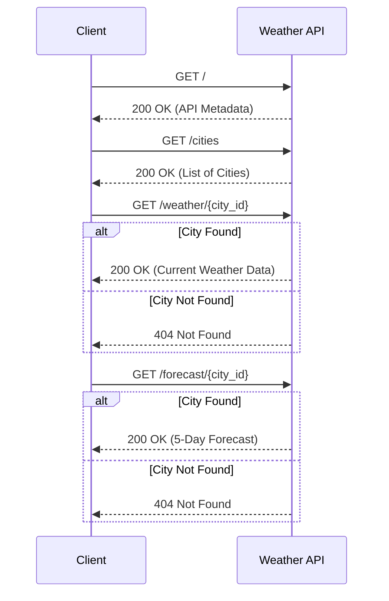

# Weather API Documentation

**Version:** 1.0.0  
**Description:** A simple Flask-based weather API powered by Flasgger.

## API Flow Visualization

Below is a sequence diagram illustrating how a client interacts with the available endpoints.



---

## Swagger / OpenAPI 3.0 Specification

You can copy the following YAML block and paste it into [editor.swagger.io](https://editor.swagger.io/) to view the interactive API documentation and test the endpoints.

```yaml
openapi: 3.0.3
info:
  title: Weather API
  description: A simple Flask-based weather API for retrieving current weather and 5-day forecasts.
  version: 1.0.0
servers:
  - url: http://localhost:5000
    description: Local development server
paths:
  /:
    get:
      summary: API Metadata
      description: Returns basic information about the API and available endpoints.
      responses:
        '200':
          description: OK
          content:
            application/json:
              schema:
                type: object
                properties:
                  name:
                    type: string
                    example: Weather API
                  version:
                    type: string
                    example: 1.0.0
                  endpoints:
                    type: object
                    additionalProperties:
                      type: string
  /cities:
    get:
      summary: List Cities
      description: Returns a list of all available cities supported by the API.
      responses:
        '200':
          description: A list of known cities
          content:
            application/json:
              schema:
                type: object
                properties:
                  cities:
                    type: array
                    items:
                      type: object
                      properties:
                        id:
                          type: string
                          example: london
                        name:
                          type: string
                          example: London
  /weather/{city_id}:
    get:
      summary: Current Weather
      description: Retrieves the current weather conditions for a specific city.
      parameters:
        - in: path
          name: city_id
          required: true
          schema:
            type: string
          description: The ID of the city (e.g., 'london', 'new_york').
      responses:
        '200':
          description: Current weather data
          content:
            application/json:
              schema:
                type: object
                properties:
                  city:
                    type: string
                    description: The name of the city
                  condition:
                    type: string
                    description: Weather condition (e.g., sunny, rainy)
                  humidity:
                    type: integer
                  source:
                    type: string
                    description: Data source (openweathermap or simulated)
                  temperature:
                    type: object
                    properties:
                      current:
                        type: number
                      feels_like:
                        type: number
                      max:
                        type: number
                      min:
                        type: number
                  timestamp:
                    type: string
                    format: date-time
                  wind_speed:
                    type: number
        '404':
          description: City not found
          content:
            application/json:
              schema:
                type: object
                properties:
                  error:
                    type: string
                    example: City not found
  /forecast/{city_id}:
    get:
      summary: 5-Day Forecast
      description: Get the 5-day weather forecast for a specific city.
      parameters:
        - in: path
          name: city_id
          required: true
          schema:
            type: string
          description: The ID of the city.
      responses:
        '200':
          description: 5-day weather forecast
          content:
            application/json:
              schema:
                type: object
                properties:
                  city:
                    type: string
                  source:
                    type: string
                  forecast:
                    type: array
                    items:
                      type: object
                      properties:
                        date:
                          type: string
                          format: date
                        temp_min:
                          type: number
                        temp_max:
                          type: number
                        condition:
                          type: string
        '404':
          description: City not found
          content:
            application/json:
              schema:
                type: object
                properties:
                  error:
                    type: string
                    example: City not found
```
