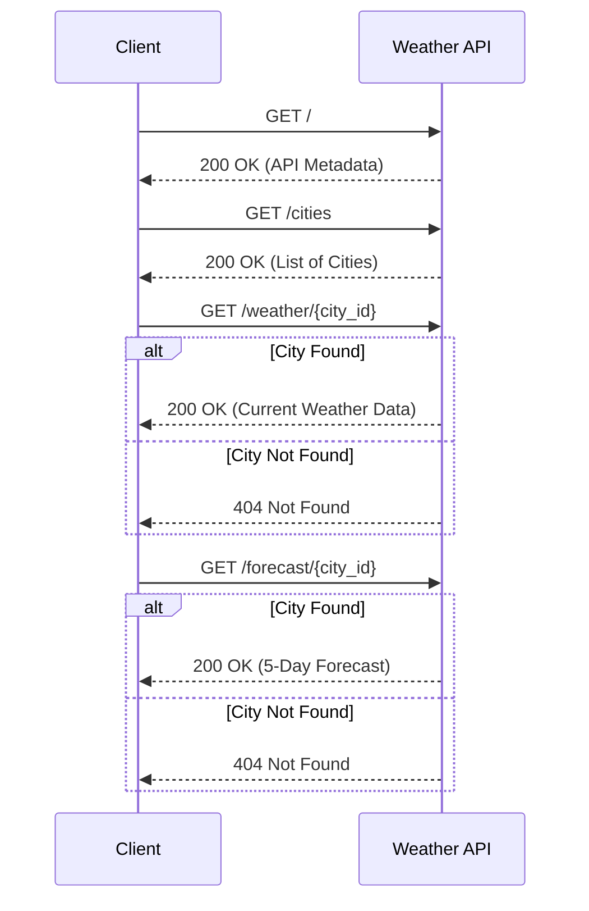

# Weather API Documentation

**Version:** 0.0.1  
**Description:** A simple Flask-based weather API powered by Flasgger.

## API Flow Visualization

Below is a sequence diagram illustrating how a client interacts with the available endpoints.



---

## Endpoints

### 1. API Metadata
Returns basic information about the API and available endpoints.

- **URL:** `/`
- **Method:** `GET`
- **Success Response:**
  - **Code:** `200 OK`
  - **Example Content:**
    ```json
    {
      "name": "Weather API",
      "version": "1.0.0",
      "endpoints": {
        "/cities": "List available cities",
        "/weather/<city>": "Get current weather for a city",
        "/forecast/<city>": "Get 5-day forecast (TODO)"
      }
    }
    ```

---

### 2. List Cities
Returns a list of all available cities supported by the API.

- **URL:** `/cities`
- **Method:** `GET`
- **Success Response:**
  - **Code:** `200 OK`
  - **Example Content:**
    ```json
    {
      "cities": [
        { "id": "london", "name": "London" },
        { "id": "new_york", "name": "New York" }
      ]
    }
    ```

---

### 3. Current Weather
Retrieves the current weather conditions for a specific city.

- **URL:** `/weather/{city_id}`
- **Method:** `GET`
- **Path Parameters:**
  - `city_id` (string, required): The ID of the city (e.g., `london`, `tokyo`).
- **Success Response:**
  - **Code:** `200 OK`
  - **Content Schema:**
    ```json
    {
      "city": "string",
      "condition": "string",
      "humidity": "integer",
      "source": "string",
      "temperature": {
        "current": "number",
        "feels_like": "number",
        "max": "number",
        "min": "number"
      },
      "timestamp": "string (date-time)",
      "wind_speed": "number"
    }
    ```
- **Error Response:**
  - **Code:** `404 Not Found` (If the city is not recognized)

---

### 4. 5-Day Forecast
Get the 5-day weather forecast for a specific city.

- **URL:** `/forecast/{city_id}`
- **Method:** `GET`
- **Path Parameters:**
  - `city_id` (string, required): The ID of the city.
- **Success Response:**
  - **Code:** `200 OK`
  - **Content Schema:**
    ```json
    {
      "city": "string",
      "source": "string",
      "forecast": [
        {
          "date": "string (date)",
          "condition": "string",
          "temp_max": "number",
          "temp_min": "number"
        }
      ]
    }
    ```
- **Error Response:**
  - **Code:** `404 Not Found` (If the city is not recognized)
